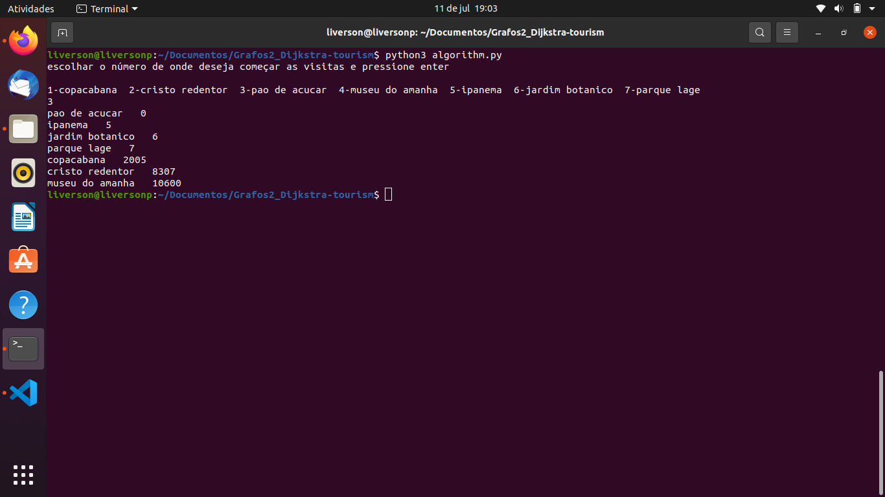
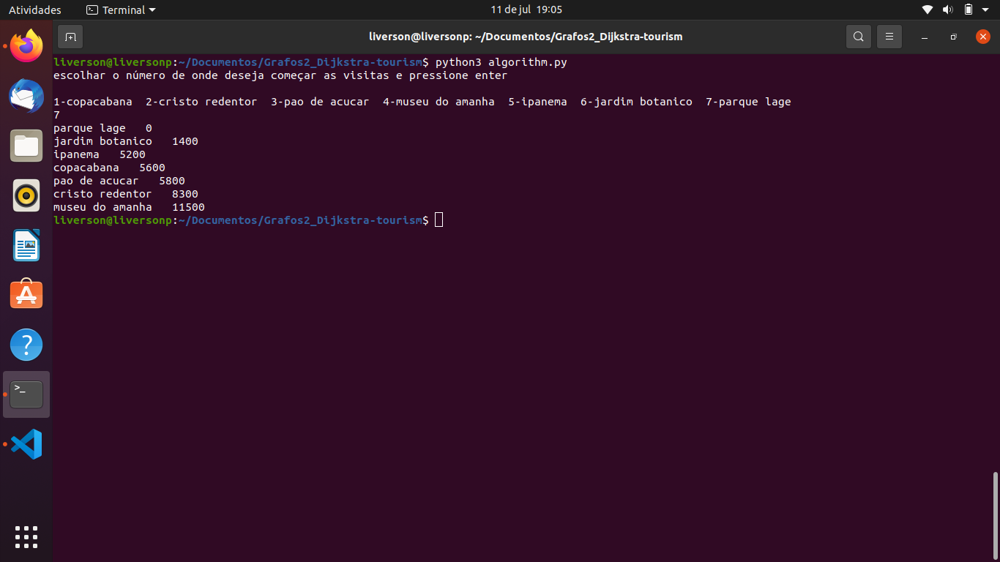
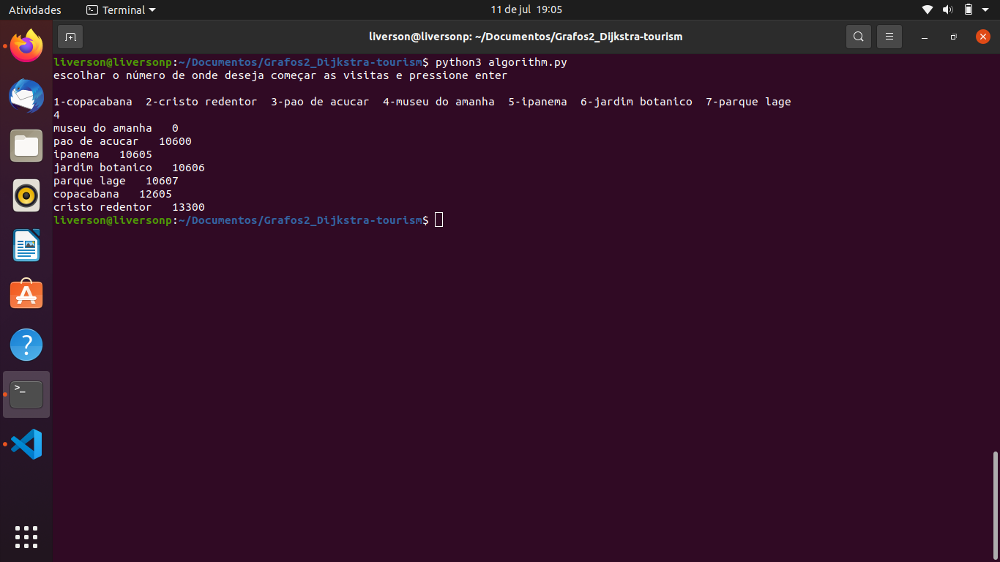

# Dijkstra tourism

**Conteúdo da Disciplina**: Grafos 2 

## Alunos
|Matrícula | Aluno |
| -- | -- |
| 180041444  |  Brenda Vitória dos Santos |
| 180022237  |  Liverson Paulo Furtado Severo |

## Sobre 
Utilizamos um mapa para estruturar os principais pontos turísticos da cidade do Rio de Janeiro. A idéia principal é fornecer as melhores rotas, utilizando conceitos de grafos, variando de acordo com os pontos que o turista deseja conhecer e em qual ele já está.

## Link do vídeo

## Screenshots

## Instalação 
**Linguagem**: python v3.8.10 

## Uso 
- Digite:
    
    python3 algorithm.py
